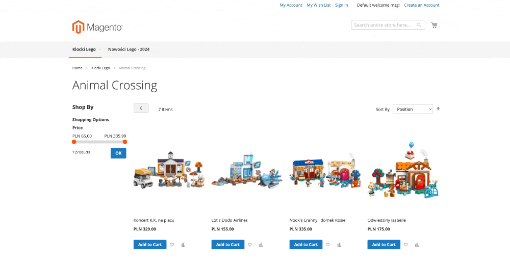
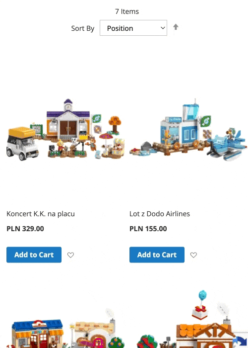

# Magento 2 Sidebar Cart
The Collab_SidebarCart module adds some CSS styles which are changing the appearance of the native dropdownDialog 
applied to minicart so it looks and behaves like a sidebar cart.

## Configuration
No special configuration is required.


| Theme  | Desktop                            | Mobile                           |
|--------|------------------------------------|----------------------------------|
| Blank  |  |  |  |
| Luma   |   |   |  | 


## Installation details
```bash
composer req collab/module-sidebar-cart
bin/magento setup:upgrade
```
